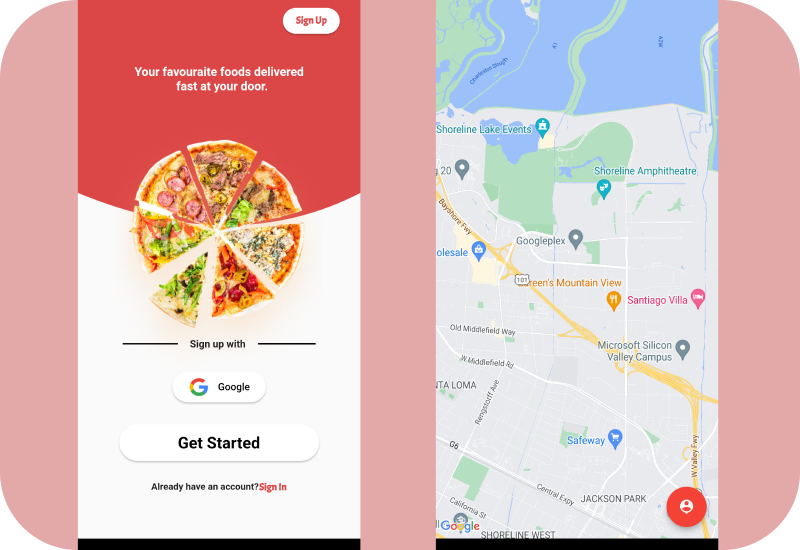
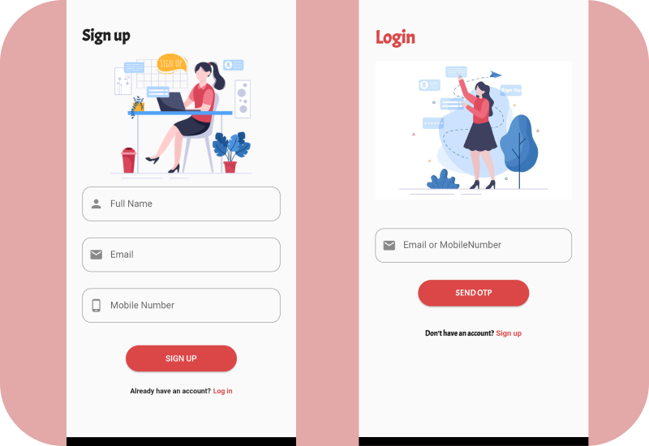

# Esfresso-Food Delivery Application.

## FRONTEND - FLUTTER , BACKEND - MONGODB
 
 This App has been developed with 'flutter framework' with a beautiful UI designs. the  backend used is 'Mongodb'. The datas are fetch from it and displaying in esfresso application.Currently Esfresso in a test mode.More features will add on.
 
 #### This app is not completed yet.Currently i am working on it .Stay tuned

### Expected Features

#### 1.Sign up with Mobile Number,OTP Verification.

#### 2.Log in with Email ,OTP Varification.

#### 3.Location access With Google maps.

#### 4.Access nearest restaurants.

#### 5.Add items to cart.

#### 6.Checkout items.

#### 7.Apply coupon code.

#### 8.Payment gateway with Razorpay.

#### 9.Give Reviews.

#### 10.Add items to Wishlist 

### Screenshot

## ThankYou For Your Suggestions

